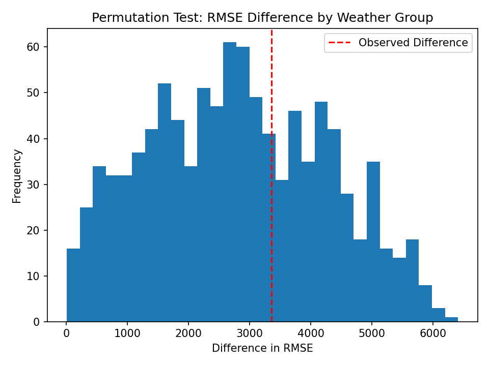

4
by Arnav Goel and Paulina Pelayo (a2goel@ucsd.edu & ppelayo@ucsd.edu)

---

## Introduction

This project analyzes major U.S. power outages in the continental United States between 2000 and 2016, using a dataset compiled from the U.S. Department of Energy. A “major outage” is defined as an event that affects at least 50,000 customers or causes an unplanned firm load loss of at least 300 MW.

Our cleaned dataset contains 1534 outages and 53 columns. We focus on:

- `OUTAGE.DURATION` – total duration of the outage in minutes  
- `CAUSE.CATEGORY` – high level cause (for example, severe weather, equipment failure, intentional attack)  
- `CUSTOMERS.AFFECTED` – number of customers impacted  
- `POPDEN_URBAN` – urban population density  
- `RES.PRICE` – average residential electricity price by state  
- Climate and seasonal fields such as `MONTH`, `CLIMATE.REGION`, and `ANOMALY.LEVEL`

Our central question is:

> **How do weather conditions, electricity prices, and population density relate to the severity of major power outages, measured by outage duration?**

Understanding how weather, electricity prices, and population density connect to outage duration helps utilities and policy makers predict where long outages are most likely, stage crews earlier, and invest in grid hardening where it actually matters.

This is getting more urgent as AI ramps up electricity demand through data centers and constant compute. A grid under heavier, more continuous load has less slack when storms hit, so failures can last longer and affect more people. Studying what drives outage severity is basically planning for a future where both climate stress and computing demand keep rising.

---

## Data Cleaning and Exploratory Data Analysis

We performed several data cleaning steps to make the outage records usable for analysis:

- Combined separate date and time columns into full timestamps `OUTAGE.START` and `OUTAGE.RESTORATION`, which makes time based comparisons consistent and lets us validate duration logic before doing any EDA or modeling.
- Dropped impossible records where the restoration time was earlier than the start time, preventing negative or corrupted OUTAGE.DURATION values from skewing the ECDF and inflating error in downstream models.
- Treated zeros in `CUSTOMERS.AFFECTED`, `OUTAGE.DURATION`, and `DEMAND.LOSS.MW` as missing values since “0” in this dataset typically reflects “not recorded” rather than a true zero, which avoids biasing distributions and keeps missingness analysis meaningful.
- Removed unused identifier columns such as `OBS` and `variables`, reducing noise and preventing models from learning patterns tied to row identifiers instead of real outage drivers.

<iframe src="assets/df_head.html" width="100%" height="300"></iframe>

To understand the distribution of outage duration, we first plotted an ECDF:

<iframe
  src="assets/duration_ecdf.html"
  width="800"
  height="600"
  frameborder="0"
></iframe>

Roughly 80 percent of outages last fewer than about 3,000 minutes, so the distribution is heavily right skewed with a small number of extremely long events.

We also examined what actually causes outages. The bar chart below summarizes the frequency of high level causes:

<iframe
  src="assets/causes_bar.html"
  width="800"
  height="600"
  frameborder="0"
></iframe>

Severe weather is by far the most common cause of major outages, followed by intentional attacks and system operability disruptions. Fuel supply emergencies are rare but, as we will see, they tend to be extremely long.

To study how outages relate to state level characteristics, we aggregated by state and looked at the relationship between urban density and outage count:

<iframe
  src="assets/density_vs_outages.html"
  width="800"
  height="600"
  frameborder="0"
></iframe>

States with higher urban population density generally experience more major outages, although there is substantial variability across states. Dense infrastructure seems to go hand in hand with more frequent large outages.

Finally, we explored how outage size and duration relate:

<iframe
  src="assets/duration_vs_customers.html"
  width="800"
  height="600"
  frameborder="0"
></iframe>

Outages that affect more customers tend to last longer on average, but there is wide scatter. Even outages with similar customer impact can have very different durations, which suggests that other drivers such as cause and weather strongly influence recovery time.

To better compare the severity of different causes, we summarized outage duration by `CAUSE.CATEGORY`:

| Cause Category            | Count | Mean Duration (min) | Median Duration (min) |
|--------------------------|------:|--------------------:|----------------------:|
| fuel supply emergency    |   38  | 13484.0             | 3960.0                |
| severe weather           |  741  | 3899.7              | 2464.0                |
| equipment failure        |   54  | 1850.6              | 224.0                 |
| public appeal            |   69  | 1468.4              | 455.0                 |
| system operability disruption | 120 | 747.1             | 222.0                 |
| intentional attack       |  332  | 521.9               | 92.5                  |
| islanding                |   44  | 200.5               | 77.5                  |

Fuel supply emergencies produce the longest outages by a large margin. Severe weather is both frequent and long, which makes it especially important from a planning perspective.

---

## Assessment of Missingness

We focused our missingness analysis on `DEMAND.LOSS.MW`, the estimated megawatt load that could not be served during an outage.

### NMAR reasoning

The missingness of `DEMAND.LOSS.MW` is plausibly **Not Missing At Random (NMAR)**. In very large or chaotic outages the monitoring infrastructure itself may be damaged or overloaded, which makes it harder to measure demand loss accurately. Very small outages might not warrant a formal MW estimate at all. Since the chance that demand loss is recorded likely depends on the true but unobserved size of the outage, we cannot fully explain missingness using other observed columns alone.

### Dependency on observed columns

We then asked whether the missingness of `DEMAND.LOSS.MW` depends on particular observed features.

1. **Dependency on outage cause**

We created an indicator column `LOSS_MISSING` for whether `DEMAND.LOSS.MW` is missing and compared missingness rates across `CAUSE.CATEGORY` using a permutation test. The observed difference between the highest and lowest missingness rate across causes was much larger than in the null distribution, giving a p value near 0. This suggests that missingness **does depend** on the cause of the outage.

We visualized this using a bar chart of missingness by cause:

<iframe
  src="assets/missingness_by_cause.html"
  width="800"
  height="600"
  frameborder="0"
></iframe>

2. **Dependency on month**

Next we tested whether missingness depends on `MONTH`. Our test statistic was the difference in mean month between rows where `DEMAND.LOSS.MW` is missing and rows where it is observed. A permutation test yielded a p value around 0.23, so we do **not** find evidence that missingness depends on month.

This is also reflected in the box plot below:

<iframe
  src="assets/missingness_month_box.html"
  width="800"
  height="600"
  frameborder="0"
></iframe>

Overall, the missingness mechanism for `DEMAND.LOSS.MW` appears consistent with MAR with respect to outage cause but potentially NMAR with respect to the true magnitude of demand loss itself.

---

## Hypothesis Testing

Motivated by our economic analysis, we tested whether states with higher residential electricity prices tend to experience shorter outages.

- **Null hypothesis (H₀)**: The distribution of outage durations in high price states is the same as or stochastically greater than in low price states.  
- **Alternative hypothesis (H₁)**: Outage durations in high price states are stochastically **smaller** than in low price states.

We split states into “High Price” and “Low Price” groups using the median of `RES.PRICE` and compared their outage duration distributions using a one sided KS style statistic. The statistic measures how often the ECDF of the high price group lies above the ECDF of the low price group.

A permutation test with 1,000 random label shuffles produced a p value of about **0.007**. At a significance level of α = 0.05 we reject the null hypothesis. The evidence suggests that states with higher residential prices tend to have **shorter** outage durations than states with lower prices, which is consistent with the idea that higher prices may be associated with greater investment in grid reliability.

---

## Framing a Prediction Problem

We next turned our descriptive findings into a prediction task.

- **Prediction problem**: Predict the duration of a major power outage in minutes.  
- **Response variable**: `OUTAGE.DURATION`  
- **Problem type**: Regression  
- **Evaluation metrics**: Root Mean Squared Error (RMSE) and R²

At the time of prediction we assume we know where and when the outage occurs plus high level information about the event, such as its cause, but not its eventual duration. Features we consider include:

- Geographic and climate features: `U.S._STATE`, `CLIMATE.REGION`, `CLIMATE.CATEGORY`, `MONTH`  
- Demographic features: `POPDEN_URBAN`, `POPULATION`  
- Economic features: `RES.PRICE`, `COM.PRICE`, `IND.PRICE`  
- Event level features: `CAUSE.CATEGORY`

Predicting outage duration matters because it gives utilities a way to estimate restoration timelines, triage scarce crews, and communicate expectations to customers and emergency services.

---

## Baseline Model

For our baseline model we restricted ourselves to a small but meaningful feature set:

- `POPDEN_URBAN`  
- `RES.PRICE`  
- `CAUSE.CATEGORY`  
- `MONTH`

We dropped rows where `OUTAGE.DURATION` is missing and used a single scikit learn `Pipeline`:

- Numerical features (`POPDEN_URBAN`, `RES.PRICE`, `MONTH`)  
  - Imputed with the median  
  - Standardized with `StandardScaler`  
- Categorical features (`CAUSE.CATEGORY`)  
  - Imputed with the most frequent category  
  - One hot encoded

We then fit a `LinearRegression` model and evaluated on a held out test set.

- **Baseline RMSE**: about **6,404** minutes  
- **Baseline R²**: about **0.165**

The model captures some signal but leaves most of the variation in outage duration unexplained, and errors are still very large in absolute time. This motivated us to engineer additional features and move to a more flexible model.

---

## Final Model

For the final model we added two features that better reflect the data generating process:

1. **`IS_WEATHER`** – an indicator for whether the outage was caused by severe weather  
2. **`LOG_POPDEN`** – `log1p` of urban population density, which reduces extreme skew and models diminishing returns in very dense grids

Our final feature set included:

- `LOG_POPDEN`, `IS_WEATHER`, `RES.PRICE`, `MONTH`, and `CAUSE.CATEGORY`

We kept the same train test split and built another scikit learn `Pipeline` that:

- Imputed numeric features with the median  
- Imputed `CAUSE.CATEGORY` with the most frequent value and one hot encoded it  
- Fit a `RandomForestRegressor`

We tuned tree depth, number of trees, and minimum samples per leaf using `GridSearchCV` with 5 fold cross validation.

On the held out test set the best model achieved:

- **Final RMSE**: about **6,189** minutes  
- **Final R²**: about **0.220**

Compared to the baseline, the final model reduces RMSE by around 200 minutes and increases R² by several percentage points. This shows that explicitly modeling weather driven outages and the nonlinear effect of urban density improves our ability to predict outage duration.

---

## Fairness Analysis

Finally, we asked whether our final model performs differently for weather related outages than for outages with other causes.

We defined two groups using the `IS_WEATHER` feature:

- Group X: outages caused by severe weather (`IS_WEATHER = 1`)  
- Group Y: outages caused by all other factors (`IS_WEATHER = 0`)

Our fairness metric was the difference in RMSE between these two groups on the test set.

- Compute RMSE for Group X and Group Y  
- Use the **absolute** difference in RMSE as the test statistic  
- Perform a permutation test that repeatedly shuffles the group labels while keeping predictions fixed

The observed RMSE difference was compared against the permutation distribution of differences from 1,000 shuffles. The resulting p value was about **0.366**.

At α = 0.05 we **fail to reject** the null hypothesis that the model’s RMSE is the same for weather and non weather outages. Under this metric we do not find evidence that the model is systematically less accurate for weather driven outages than for other outages.

---

*This project was completed for DSC 80: The Practice and Application of Data Science at UC San Diego.*
